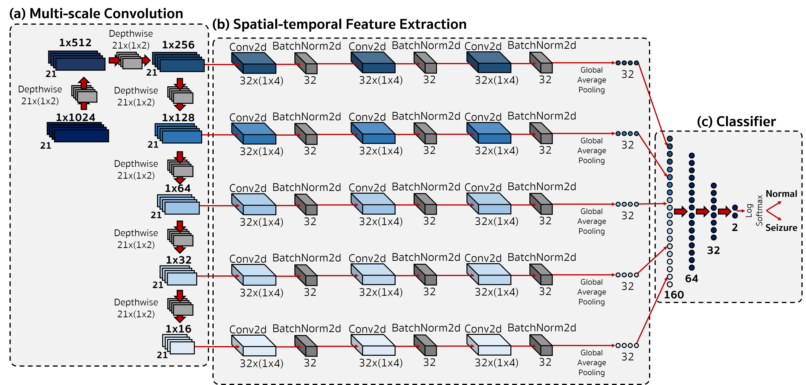

# EEGWaveNet 
Wavelet Decomposition Inspired Multi-Scale CNN for EEG Seizure Detection
***
## About the work
EEGWaveNet is a wavelet-inspired convolutional neural network initially designed for epileptic seizure detection. Recently, the model showed
***
## Model architecture
The model consists of 3 modules as follow.
1. Multi-scale Convolution Module
2. Spectral-temporal Feature Extraction Module
3. Multilevel Preceptron Classifier Module


##### Multi-scale Convolution Module
The module mimics wavelet by treating depthwise convolution as transformation coefficients.
##### Spectral-temporal Feature Extraction Module
This module utilizes convolutions and batchnorm to normalize each transformed signal from module A.
##### Multilevel Preceptron Classifier Module
A MLP layer to classify the concatenated output vector.
***
## Usage
##### Create model variable
```python
model = EEEWaveNet.functions.build(n_chans,n_classes)
```
This code returns a torch model that inputs a tensor of shape
```python
(None,n_chans,1,T)
```
and outputs a probability distribution of shape
```python
(None,n_classes)
```
##### Train model
```python
EEEWaveNet.functions.train(Model,
	X_train,
	y_train,		
	X_val,
	y_val,
	n_epochs=69420,
	batch_size=64,
	learning_rate=1e-3,
	weight_decay=0,
	patience=10,
	n_classes)
```
Returns three variables
```python
Saved_model ## The final weights from gradient descent
History ## The model training and validation loss
Time ## Training time per epoch
```
